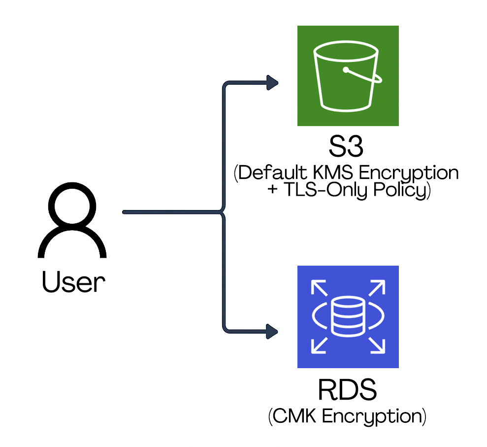

# AWS CSS – Domain 5 – End-to-End Data Protection with KMS, S3 & RDS  

Built and validated encryption at rest and in transit in AWS using **KMS CMKs, S3 default encryption + TLS-only policies and RDS encryption**. This lab demonstrates strong data governance with proof of blocked vs compliant operations.  

**Why it matters:** Protecting sensitive data requires both **technical enforcement (encryption, TLS)** and **governance (key policies, least privilege access)**. This lab shows how to combine AWS-native tools for secure, compliant data handling.  

---

## Table of Contents

- [Overview](#overview)  
- [Objectives](#objectives)  
- [Diagram](#diagram)  
- [Steps Performed](#steps-performed)  
  - [1. KMS Key Creation & Governance]  
  - [2. Apply Key Policy]  
  - [3. S3 Bucket Encryption]  
  - [4. TLS-Only Bucket Policy]  
  - [5. RDS Instance Encryption]  
  - [6. CLI Testing: AccessDenied vs Success]  
  - [7. Cleanup]  
- [Screenshots](#screenshots)  
- [Lessons Learned](#lessons-learned)  
- [References](#references)  
- [Cleanup](#cleanup)  
- [Contact](#contact)  

---

## Overview

This lab implements **Domain 5: Data Protection** from the AWS Security Specialty exam:  

- **Customer Managed KMS Key** with strict policies.  
- **S3 bucket** encrypted with CMK by default + TLS-only enforcement.  
- **RDS instance** encrypted with same CMK.  
- **CLI tests** proving policy enforcement (blocked vs allowed uploads)  

---

## Objectives

- Create a **KMS CMK** with least-privilege access.  
- Enforce **default encryption at rest** on S3 and RDS with CMK.  
- Enforce **encryption in transit** with TLS-only bucket policy.  
- Validate that unencrypted/HTTP uploads fail while compliant uploads succeed.  

---

## Diagram

Flow: **User → S3 (Default KMS Encryption + TLS-Only Policy) → RDS (CMK Encryption)**  

  

---

## Steps Performed

### 1. KMS Key Creation & Governance
   - Created **CMK** with alias `project-dp-lab-cmk`.  
   - Configured **Key Administrators** = `admin-user`.  
   - Configured **Key Users** = `S3AccessRole`, `AWSServiceRoleForRDS`.  
   - Verified least-privilege access *(Screenshots: `kms-cmk-summary.png` & `kms-key-users.png`)*  

### 2. Apply Key Policy
   - Replaced default policy with strict JSON.  
   - Allowed only `admin-user` for key management.  
   - Allowed only `S3AccessRole` + `AWSServiceRoleForRDS` for encrypt/decrypt *(Screenshot: `kms-policy.png`)*  

### 3. S3 Bucket Encryption
   - Created S3 bucket `dp-lab-secure-bucket`.  
   - Enabled **Default Encryption** with CMK.  
   - Verified object encrypted with CMK *(Screenshots: `s3-default-encryption.png`, `s3-object-encryption.png`)*  

### 4. TLS-Only Bucket Policy
   - Applied bucket policy with `aws:SecureTransport = true`.  
   - Enforced HTTPS-only, blocking HTTP traffic *(Screenshot: `s3-bucket-policy-tls.png`)*  

### 5. RDS Instance Encryption
   - Created `dp-lab-db` (MySQL 8.4, db.t3.micro).  
   - Enabled encryption at rest with CMK.  
   - Verified in configuration: `StorageEncrypted = true`, `KMS key = alias/project-dp-lab-cmk` *(Screenshots: `rds-encryption-cmk.png` & `rds-config-encryption.png`)*  

### 6. CLI Testing: AccessDenied vs Success
   - **HTTP Upload** → blocked with AccessDenied.  
   - **AES256 Upload** → overridden by CMK policy.  
   - **KMS CMK Upload** → success *(Screenshots: `s3-upload-denied.png` & `s3-upload-success.png`)*  

### 7. Cleanup
   - Deleted **S3 bucket** (after emptying).  
   - Deleted **RDS instance** (no snapshot).  
   - Removed **IAM roles** (`S3AccessRole`, custom RDS role).  
   - Disabled and scheduled deletion for **CMK**.  

---

## Screenshots  

*All screenshots are included in the `screenshots/` folder.*  

| Step | Filename                      | Description                                             |
| ---- | ----------------------------- | ------------------------------------------------------- |
| 1    | iam-s3accessrole-summary.png  | IAM role summary for S3 access                          |
| 1    | iam-rdsaccessrole-summary.png | IAM role summary for RDS access                         |
| 1    | kms-cmk-summary.png           | KMS CMK created with alias and ARN                      |
| 1    | kms-key-users.png             | CMK key users showing S3 and RDS roles                  |
| 2    | kms-policy.png                | KMS key policy JSON with least-privilege restrictions   |
| 3    | s3-default-encryption.png     | S3 bucket with default encryption set to CMK            |
| 3    | s3-object-encryption.png      | S3 object properties showing CMK encryption             |
| 4    | s3-bucket-policy-tls.png      | S3 bucket policy enforcing TLS-only access              |
| 5    | rds-encryption-cmk.png        | RDS encryption enabled with CMK during creation         |
| 5    | rds-config-encryption.png     | RDS DB configuration showing encryption with CMK        |
| 6    | s3-upload-denied.png          | CLI output: upload blocked with AccessDenied            |
| 6    | s3-upload-success.png         | CLI output: successful CMK-encrypted upload             |

---

## Lessons Learned

- **CMKs provide control**: ownership, access boundaries and governance are critical.  
- **Default S3 encryption + TLS-only** ensures strong baseline without client-side config.  
- **RDS with CMK** extends encryption coverage beyond object storage.  
- **Proving failures is as important as proving success** → recruiters see governance in action.  
- **Cleanup discipline** avoids unnecessary AWS costs.  

---

## References

- [AWS KMS](https://docs.aws.amazon.com/kms/latest/developerguide/overview.html)  
- [Amazon S3 Encryption](https://docs.aws.amazon.com/AmazonS3/latest/userguide/serv-side-encryption.html)  
- [Bucket Policies](https://docs.aws.amazon.com/AmazonS3/latest/userguide/bucket-policies.html)  
- [Amazon RDS Encryption](https://docs.aws.amazon.com/AmazonRDS/latest/UserGuide/Overview.Encryption.html) 
- [AWS CLI S3](https://docs.aws.amazon.com/cli/latest/reference/s3/index.html)  

---

## Contact  

Sebastian Silva C. – September 2025 – Berlin, Germany.  
- [LinkedIn](https://www.linkedin.com/in/sebastiansilc/)  
- [GitHub](https://github.com/AWS-CSS-Portfolio)  
- [sebastian@playbookvisualarts.com](mailto:sebastian@playbookvisualarts.com)  
